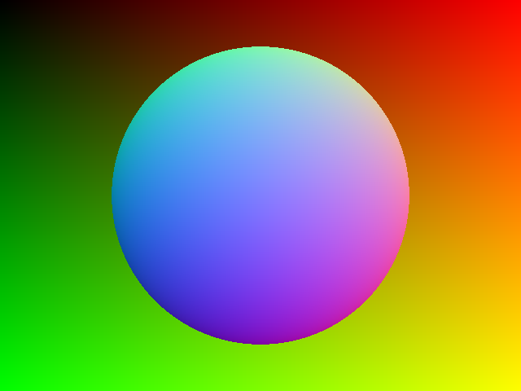

# RustTracer

I've never written more than Hello World in Rust. I haven't written a raytracer in years and years. Not much graphics code at all actually. You might even say I'm ... *ahem* a bit rusty.

Anyways, what better project could there be than to write a raytracer in Rust?

Follow along here and at https://4d4ms.com

